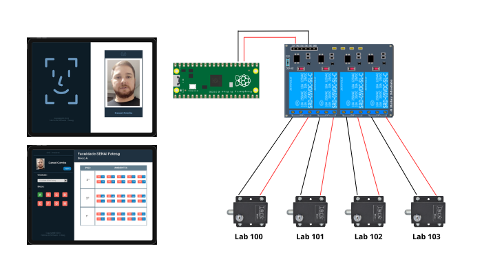

    

 
 
 

    

 
<h2> Sistema de Controle de Acesso a Ambientes </h2>
<h3> 1 - Visão Geral do Software </h3>

Controlar o acesso a ambientes de sala de aula, surge da necessidade de garantir a segurança do ambiente, dos equipamentos, dos alunos, docentes e funcionários da instituição. Dentro deste contexto, uma necessidade primordial é assegurar o acesso restrito a ambientes de pessoas autorizadas, de modo a garantir a privacidade e proteção aos recursos de valor dentro desses ambientes. Há também a necessidade de monitorar o histórioco de acesso aos ambientes, registrando-se a data, horário e usuário que acessou um determinado ambiente.

<h4> 1.1 - Objetivo do Software </h4>

   O objetivo do Sistema de Controle de Acesso a Ambientes é gerenciar o acesso a sala de aula, utilizando reconhecimento facial. Sua função principal consiste em reconher a face do usário, autorizar o  acesso, comandar a liberação da tranca eletromagnética do ambiente e manter o histórico com data, horário e usuário que acessou aquele espaço.

    

<h4> 1.2 - Escopo do Projeto e Requisitos de Software </h4>

O escopo deste projeto restringe-se a implementar uma aplicação web que contemple os seguintes requisitos funcionais:

<ul>
<li> permitir o cadastro de diferentes tipos de ambientes, como sala de aula, laboratórios e  auditórios;
</li>
<li>
permitir o cadastro de usuários com diferentes perfis de acesso, tal como professor, aluno e funcionários;
</li>
<li>
liberar o acesso aos ambientes utilizando  reconhecimento facial;
</li>
<li>
manter o histórico de acesso a cada ambiente, registrando-se data, horário e usuário que a acessou;
</li>
<li>
permitir o cadastro do embarcado e o seu vinculo a um ambiente. O embarcado deve  comandar a liberação da tranca eletromagnética para o acesso a sala de aula.
</li>

</ul>

 
<h4> 1.3 - Requisitos do Software </h2>
 

Lista de requisitos

 

<table>
    <thead>
    <tr>
        <th>ID</>
        <th> Nome </th>
        <th>DESCRIÇÃO</>
    </tr>
    </thead>
    <tbody>
        <tr>
            <td>RF01</td>
            <td>Manter usuários</td>
            <td>o sistema deve permitir incluir, excluir, atualizar e buscar informações do usuário: nome, cpf, celular e e-mail;</td>
        </tr>
        <tr>
            <td>RF02</td>
            <td>Autenticar usuários</td>
            <td>o sistema deve permitir incluir, excluir, atualizar e buscar informações do usuário: nome, cpf, celular e e-mail;</td>
        </tr>
        <tr>
            <td>RF03</td>
            <td>Manter perfil de usuários</td>
            <td>o sistema deve permitir incluir, excluir, atualizar e buscar informações do usuário: nome, cpf, celular e e-mail;</td>
        </tr>
        <tr>
            <td>RF03</td>
            <td>Manter contato</td>
            <td>o sistema deve permitir incluir, excluir, atualizar e buscar informações do usuário: nome, cpf, celular e e-mail;</td>
        </tr>
    </tbody>
</table>

 
<h4> 1.4 - Modelo de Domínio </h2>
 
<h3> 2 - Arquitetura do Software </h2>
<h4> 2.1 - Design da Arquitetura de Software </h2>
<h4> 1.2 - Tecnologias da implementação </h2>
 
<h3> Referências </h3>
 
<h3> Contatos </h3>

