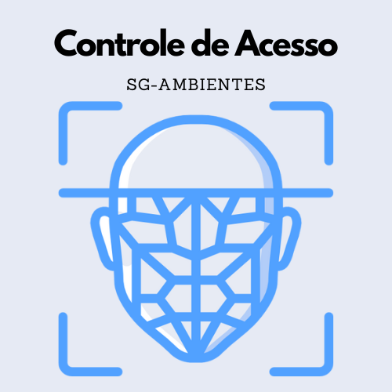

    

 
 
 

    

 
<h1> Sistema de Controle de Acesso a Ambientes </h1>
<h3> 1 - Visão Geral do Software </h2>
 

    Os responsáveis pelo controle de acesso em ambientes de sala de aula podem ter várias dores ou necessidades, dependendo da natureza do ambiente e do contexto específico. Algumas possíveis dores e necessidades podem incluir:

Segurança: Um dos principais objetivos do controle de acesso é garantir a segurança dos alunos, professores e demais funcionários da instituição. Portanto, a dor mais comum pode ser a necessidade de garantir que somente pessoas autorizadas tenham acesso às salas de aula e outros ambientes restritos.

Privacidade: Algumas salas de aula podem ter equipamentos ou materiais sensíveis ou confidenciais, que precisam ser protegidos de acesso não autorizado. Portanto, a necessidade de garantir que apenas pessoas autorizadas tenham acesso pode estar relacionada à proteção da privacidade e da segurança desses recursos.

Gestão de recursos: Em algumas instituições, é necessário controlar o acesso a salas de aula e outros ambientes para garantir o uso eficiente dos recursos disponíveis, como salas de aula equipadas com computadores ou outros equipamentos. Nesse caso, a dor pode ser a necessidade de gerenciar o uso desses recursos para maximizar sua utilização.

Monitoramento: Alguns responsáveis pelo controle de acesso podem precisar monitorar o uso de salas de aula e outros ambientes para fins de auditoria, segurança ou outras finalidades. Nesse caso, a dor pode ser a necessidade de obter informações detalhadas sobre quem está usando os ambientes, quando e por quanto tempo.

Flexibilidade: Dependendo do contexto, pode ser necessário conceder acesso a diferentes pessoas em diferentes momentos, ou a grupos específicos de pessoas em horários específicos. Nesse caso, a dor pode ser a necessidade de garantir que o sistema de controle de acesso seja flexível o suficiente para acomodar diferentes cenários e necessidades.

 
<h4> 1.1 - Objetivo do Software </h2>
<h4> 1.2 - Escopo do Software </h2>
 
<h4> 1.3 - Requisitos do Software </h2>
 

Lista de requisitos

 

<table>
    <thead>
    <tr>
        <th>ID</>
        <th>DESCRIÇÃO</>
    </tr>
    </thead>
    <tbody>
        <tr>
            <td>RF01</td>
            <td>Cadastrar usuários</td>
        </tr>
        <tr>
            <td>RF02</td>
            <td>Autenticar usuários</td>
        </tr>
        <tr>
            <td>RF03</td>
            <td>Manter perfil de usuários</td>
        </tr>
        <tr>
            <td>RF03</td>
            <td>Manter contato</td>
        </tr>
    </tbody>
</table>

 
<h4> 1.4 - Modelo de Domínio </h2>
 
<h3> 2 - Arquitetura do Software </h2>
<h4> 2.1 - Design da Arquitetura de Software </h2>
<h4> 1.2 - Tecnologias da implementação </h2>
 
<h3> Referências </h3>
 
<h3> Contatos </h3>

