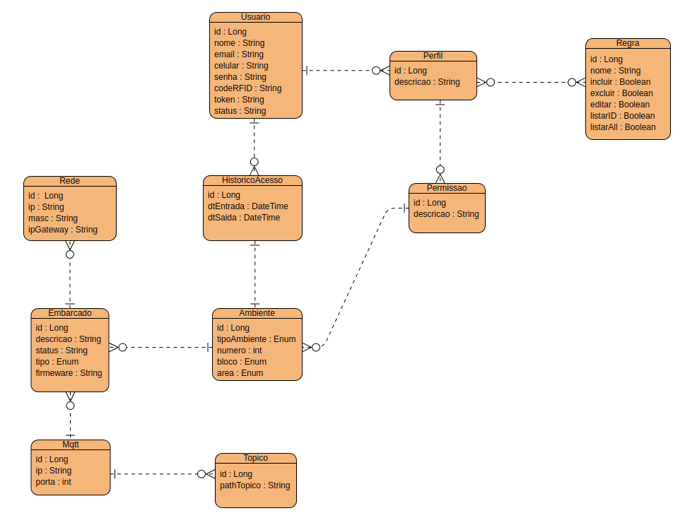
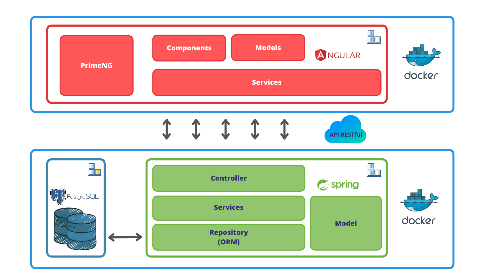

    

 
 
 

    

 
<h2> Sistema de Controle de Acesso a Ambientes </h2>
<h3> 1 - Visão Geral do Software </h3>

Controlar o acesso a ambientes de sala de aula, surge da necessidade de garantir a segurança do ambiente, dos equipamentos, dos alunos, docentes e funcionários da instituição. Dentro deste contexto, uma necessidade primordial é assegurar o acesso restrito a ambientes de pessoas autorizadas, de modo a garantir a privacidade e proteção aos recursos de valor dentro desses ambientes. Há também a necessidade de monitorar o histórioco de acesso aos ambientes, registrando-se a data, horário e usuário que acessou um determinado ambiente.

<h4> 1.1 - Objetivo do Software </h4>

   O objetivo do Sistema de Controle de Acesso a Ambientes é gerenciar o acesso a sala de aula, utilizando reconhecimento facial. Sua função principal consiste em reconher a face do usário, autorizar o  acesso, comandar a liberação da tranca eletromagnética do ambiente e manter o histórico com data, horário e usuário que acessou aquele espaço.

    

<h4> 1.2 - Escopo do Projeto e Requisitos de Software </h4>

Os requisitos funcionais descrevem as funções, que o sistema deve executar e as tarefas que ele deve realizar. Neste documento, apresentaremos os requisitos funcionais do Sistema de Controle de Acesso a Ambientes, definidos a partir das necessidades do cliente vinculado a este projeto. As principais necessidades e requisitos funcionais abaixo. Além disso, apresentaremos uma descrição detalhada de como o modelo Entidade-Relacionamento (ER) foi desenvolvido para atender a esses requisitos, incluindo as entidades, relacionamentos e atributos necessários para armazenar e gerenciar as informações do sistema.

 

Após diversas reuniões com o cliente, restringiu-se o escopo deste projeto a implementação de um aplicação web que contemple as necessidades detalhadas abaixo:

 
<ul>
<li> permitir o cadastro de diferentes tipos de ambientes, como sala de aula, laboratórios e  auditórios;
</li>
<li>
permitir o cadastro de usuários com diferentes perfis de acesso, tal como professor, aluno e funcionários;
</li>
<li>
liberar o acesso aos ambientes utilizando  reconhecimento facial;
</li>
<li>
manter o histórico de acesso a cada ambiente, registrando-se data, horário e usuário que a acessou;
</li>
<li>
permitir o cadastro do embarcado e o seu vinculo a um ambiente. O embarcado deve  comandar a liberação da tranca eletromagnética para o acesso a sala de aula.
</li>

</ul>
 
 

 Fundamentado nas necessidades levantadas com o cliente, foram identificados os seguintes requisitos funcionais :
 
 

<table>
    <thead>
    <tr>
        <th>ID</>
        <th> Nome </th>
        <th>DESCRIÇÃO</>
    </tr>
    </thead>
    <tbody>
        <tr>
            <td><b>RF01</b></td>
            <td><b>Manter usuários</b></td>
            <td>O sistema deve permitir incluir, excluir, atualizar e buscar informações do usuário, como nome, cpf, celular e e-mail. A busca será realizada pelo e-mail e os dados persistidos em um banco de dados</td>
        </tr>
        <tr>
            <td><b>RF02</b></td>
            <td><b>Autenticar usuários</b></td>
            <td>A autenticação do usuário deve verificada ;</td>
        </tr>
        <tr>
            <td><b>RF03</b></td>
            <td><b>Manter perfil de usuários</b></td>
            <td>o sistema deve permitir incluir, excluir, atualizar e buscar informações do usuário: nome, cpf, celular e e-mail;</td>
        </tr>
        <tr>
            <td><b>RF04</b></td>
            <td><b>Manter contato</b></td>
            <td>o sistema deve permitir incluir, excluir, atualizar e buscar informações do usuário: nome, cpf, celular e e-mail;</td>
        </tr>
    </tbody>
</table>

 
<h4> 1.4 - Modelo de Domínio </h2>

A documentação do modelo Entidade-Relacionamento (ER) é uma etapa crucial no processo de desenvolvimento de um sistema de informação. O modelo ER é usado para representar a estrutura do banco de dados, incluindo as entidades, relacionamentos e atributos. A partir desse modelo, é possível criar um esquema de banco de dados que possa ser implementado em um sistema de gerenciamento de banco de dados (SGBD). Neste documento, apresentaremos o modelo ER para Sistema de Controle de Acesso a Ambientes que contém a descrição detalhada dessa estrutura, incluindo as entidades, relacionamentos, chaves primárias e estrangeiras.

    

<h3> 2 - Arquitetura do Software </h2>

 A arquitetura de software de uma aplicação é o conjunto de decisões de design que definem como os diferentes componentes do sistema se relacionam e interagem entre si. Ela é responsável por garantir que a aplicação seja escalável, segura e capaz de lidar com as demandas dos usuários de forma eficiente. A documentação técnica da arquitetura de software é uma parte fundamental do processo de desenvolvimento, pois ajuda a equipe a entender como o sistema funciona e como cada componente se relaciona com os demais. Neste documento, serão descritos os principais componentes da arquitetura da aplicação, como eles se comunicam e quais são as suas responsabilidades. Além disso, serão apresentadas as principais tecnologias utilizadas na implementação da arquitetura, assim como as decisões de design que levaram à escolha dessas tecnologias.

<h4> 2.1 - Design da Arquitetura de Software </h2>

    

<h4> 1.2 - Tecnologias da implementação </h2>
 
<h3> Referências </h3>
 
<h3> Contatos </h3>

